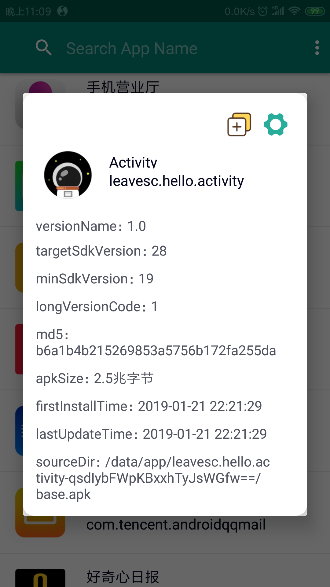
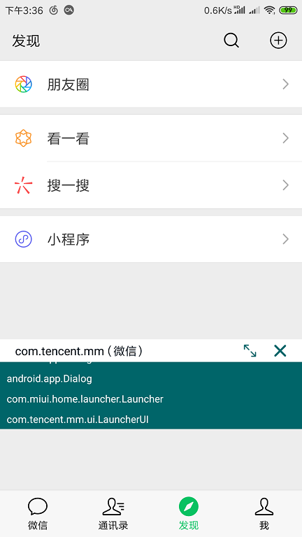

# Activity

这是一个纯 Kotlin 的项目，可以用于查看系统安装的所有应用的详细信息，包括**应用包名、版本号、apk大小、首次安装时间、最后更新时间、apk路径、签名md5值等**

并且可以查看当前系统顶层 Activity 的全路径，方便在反编译应用的时候快速定位路径

做这么一个应用的目的有两个

一个是因为想要用 Kotlin 来练练手，毕竟 Kotlin 现在也算作是很流行的了

另外一个目的是在很久前在注册某个平台的账号时，需要获取 apk 的 md5 值，当时是通过命令行来获取的，觉得很不方便，就一直有写个 App 来获取签名值的想法，现在也算作达成所愿了

## App 下载地址：[Activity](https://www.pgyer.com/ActivityLeaves)

